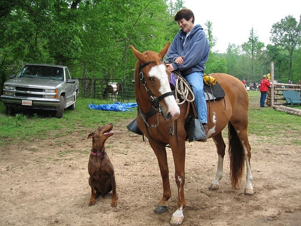
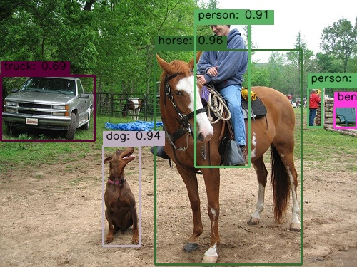

## YOLO v10

This repo contains YOLOv10 wrapper using ONNX model under the hood.

[ONNX model for YOLOv10-m](https://huggingface.co/onnx-community/yolov10m/tree/main)

### Usage

`
uv venv --python 3.9 venv
`

`
uv pip install -r requirements.txt
`

Asumming you are in YOLOv10\ directory:

`
python src\main.py --input-image horse.jpg
`

### Model Output
#### Input Image

#### Detection Result

### Performance
 
- Pre-processing time : 14.318 ms  
- Inference time : 1357.630 ms  
- Post-processing time : 2.294 ms  

### References

This [tutorial](https://docs.opencv.org/4.x/da/d9d/tutorial_dnn_yolo.html) from openCV is quite helpful
